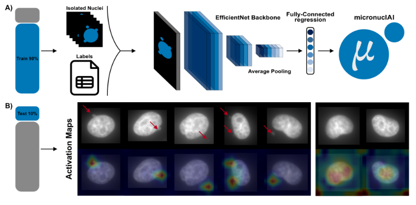
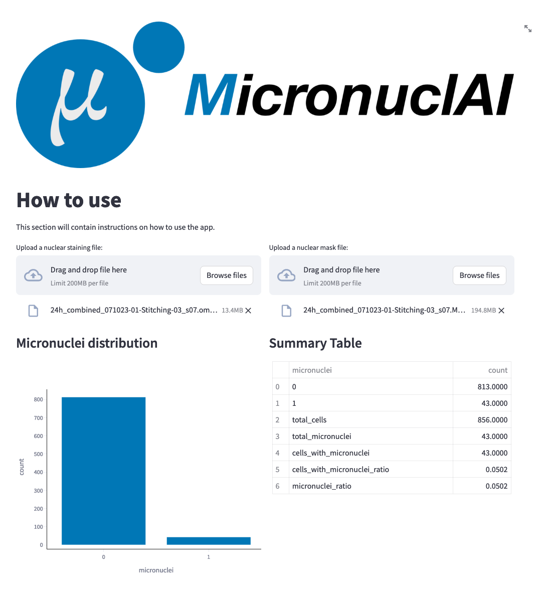

# micronuclAI

[](https://pypi.org/project/micronuclai/)
[](https://pypi.org/project/micronuclai/)
[](https://pypi.org/project/micronuclai/)
[](https://pypi.org/project/micronuclai/)


**Automated assessment of Chromosomal Instability through quantification of micronuclei (MN) and Nuclear Buds (NBUDs).**



micronuclAI is an automated pipeline for reliable quantification of micronuclei of varying size, morphology and location from nuclei-stained images. The pipeline can be divided into 3 steps: 1) segmentation, 2) nuclei isolation, and 3) quantification. In brief, single-cell crops are extracted from high-resolution microscopy images with the help of segmentation masks, which are then used to train a convolutional neural network (CNN) to output the number of MN associated with each cell. 

## Getting Started

### Stream-lit App

A webapp implementation of micronuclAI is available through streamlit under:

**GitHub:**  
https://github.com/SchapiroLabor/micronuclAI_streamlit

**Streamlit:**  
https://micronuclai.streamlit.app



Inference of micronuclei can be achieved in small to medium-sized example images that can be uploaded to the streamlit app. Image data is processed within a virtual machine (VM) on Heicloud, a local Cloud infrastructure provided by University Computing Center Heidelberg, and images are immediately deleted after micronuclei inference. Once micronuclei are inferred, results predictions as well as several plots describing the results are generated and presented to the user within the streamlit app which can also be downloaded as csv files. 

## Installation

We recomend to install micronuclAI in a clean environment with Python 3.10, 3.11, or 3.12.  
micronuclAI uses PyTorch as the main deep learning framework, check the [official website](https://pytorch.org/) for the specific installation instructions for your system.

### Install micronuclAI from PyPI.
```bash
pip install micronuclai
```
## Usage

Two input files are required for micronuclAI
1. Nuclei-stained Image 
2. Associated Mask


You can use micronuclAI to predict micronuclei in an image using the following command:

```
micronuclai-predict.py -i <path/to/image> -m <path/to/mask> -mod <path/to/model> -o <path/to/output/folder>
```

A test dataset has been provided in the [test_data](test) folder with a [mask](test/test_mask.tiff) and its corresponding [image](test/test_image.tiff) file.

```
python src/model/micronuclai_predict.py -i ./test/test_image.tiff -m ./test/test_mask.tiff -mod ./models/micronuclai.pt -o ./test/output
```

### Parameters and Arguments
| Parameter          | Short Form | Required | Default    | Type         | Description                                                                                       |
|--------------------|------------|----------|------------|--------------|---------------------------------------------------------------------------------------------------|
| `--image`          | `-i`       | Yes      | N/A        | String       | Pathway to image.                                                                                 |
| `--mask`           | `-m`       | Yes      | N/A        | String       | Pathway to mask.                                                                                  |
| `--model`          | `-mod`     | Yes      | N/A        | String       | Pathway to prediction model.                                                                      |
| `--out`            | `-o`       | Yes      | N/A        | String       | Path to the output data folder.                                                                   |
| `--size`           | `-s`       | No       | (256, 256) | List of int  | Size of images for training.                                                                      |
| `--resizing_factor`| `-rf`      | No       | 0.6        | Float        | Resizing factor for images.                                                                       |
| `--expansion`      | `-e`       | No       | 25         | Int          | Expansion factor for images.                                                                      |
| `--device`         | `-d`       | No       | "cpu"      | String       | Device to be used for training.                                                                   |
| `--batch_size`     | `-bs`      | No       | 32         | Int          | Batch size for training.                                                                          |


## Citation

https://doi.org/10.1038/s42003-025-07796-4

```
@article{IbarraArellano2025,
  title = {micronuclAI enables automated quantification of micronuclei for assessment of chromosomal instability},
  volume = {8},
  ISSN = {2399-3642},
  url = {http://dx.doi.org/10.1038/s42003-025-07796-4},
  DOI = {10.1038/s42003-025-07796-4},
  number = {1},
  journal = {Communications Biology},
  publisher = {Springer Science and Business Media LLC},
  author = {Ibarra-Arellano,  Miguel A. and Caprio,  Lindsay A. and Hada,  Aroj and Stotzem,  Niklas and Cai,  Luke L. and Shah,  Shivem B. and Walsh,  Zachary H. and Melms,  Johannes C. and W\"{u}nneman,  Florian and Bestak,  Kresimir and Mansaray,  Ibrahim and Izar,  Benjamin and Schapiro,  Denis},
  year = {2025},
  month = mar 
}
```

## License

micronuclAI offers a dual licensing mode the [GNU Affero General Public License v3.0](LICENSE) - see [LICENSE](LICENSE) and [ESSENTIAL_LICENSE_CONDITIONS.txt](ESSENTIAL_LICENSE_CONDITIONS.txt)
